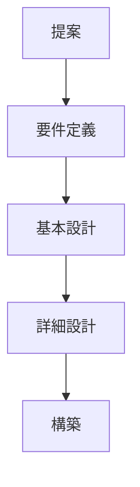

title:ITインフラの開発者となるなるためには


# 1. なりたい将来をイメージする

## 1.1 どうステップを踏んでいけば？
なりたい自分をイメージすると言っても、まずITインフラ開発者ってどんな仕事をするのか分からない人も多いでしょう。
私の経験上、独学でITインフラを学ぶにしてもOSやソフトウェアの技術的な資料はいくらでもあるのに対して、それを設計するために、どのような考えを基に設計していくべきか、資料がなく苦悩し試行錯誤するしかないのが現実でした。
また実際、会社である長い新人研修はITインフラの内容は薄く、実務に繋がる技術を教えるわけではなく、技術的な理屈も大事ですが理屈ばかり教えられます。(私はSE職は中途であったため新人研修は受けていませんが)

では、考え方(設計思想)や導き方は、どこにあるかと言うと先人の思いの中でしかありません。
もちろん、設計書にきちんと思想や導き方を記載している人はいますが、その背景までは伺い知ることは出来ません。
思いの中と言う事は、しっかりと設計しているわけではないので、資料として残っていなく、打ち合わせの席で口頭で決まっていることが殆どで、後輩にもうまく伝えたわりません。
結局、職人と一緒で先輩の背中を見て成長の糧とするしかなかったのです。
もちろん、優秀な先輩の配下に配属されれば今まで培った技術を教えてくれるでしょうが、もしそうでなければいい環境に巡り合えた同期との技術的な差はあっという間に拡がるでしょう。

結局、暗中模索し仕事を覚えていくことになります。
そんな非効率な時間を過ごさないためにITインフラ開発者を目指す人に少しでも参考になるようにと私の考えを書き記します。
もちろん私の経験則から記載するので色々なベンダー、SIer、エンドユーザによって違うので、一概に記載した内容が全てマッチするとは思ってません。(私も色々な現場で、困惑した覚えがあります。)
ですが、少なくとも流れや考え方は、基本的に同じだと考えているので参考にはなるかと思ってます。(本当は、試行錯誤した方が身になるのだがｗ)

## 1.2 そもそもSEとは？ITインフラ開発者とは？

まず、SEとはなんでしょう？
友人や親族に『お仕事は？』と聞かれるとSEと答える人が殆どでしょう。
(私は、具体的にこんなのを作ってると話すことの方が多いですが)

SEと言っても、役割はいくつあるのだろうか？
と思う程、多種多様です。

## 1.3 『SE職の種類』

現在の一般的なSE職の種類を羅列してみました。

**「アプリケーションエンジニア」**
アプリケーションエンジニアは、個別の情報システムを担当します。
顧客との打ち合わせでシステムの要件定義を行い、取りまとめた仕様を設計書に起こします。
設計書に基づき作成したプログラムのレビューを行います。プログラムをテストするために、テスト計画を作成することもあります。

**「プログラマ」**
プログラマは、プログラム言語を使ってプログラムを作成し、システムやソフトウェアを作る技術者です。
一般的には、SE(アプリケーションエンジニア)がシステムの設計書を作成し、プログラマが設計書をもとにプログラムを作り上げていきます。

**「サーバエンジニア」**
サーバーエンジニアは、サーバーの設計・構築・保守を行うエンジニアです。
サーバエンジニアの仕事内容は幅広く、設計と言っても、サーバ構成設計、運用設計、冗長構成設計、性能設計、災害対策設計、バックアップ設計などのサーバの設定全般になります。

**「データベースエンジニア」**
データベースエンジニアは、顧客情報や商品情報などのデータを格納するデータベースを設計・構築・保守するエンジニアです。
設計・構築にあたり、パフォーマンスチューニングを行い、パフォーマンスを最適化したり、不正アクセスを防ぐためにセキュリティ対策を行います。

**「ネットワークエンジニア」**
ネットワークエンジニアは、サーバやPCをファイアウォール、ルータ、スイッチ等の専用機器に接続し、個々のコンピュータのデータを要件通りに送受信するネットワークシステムを設計・構築・保守するエンジニアです。

**「セキュリティエンジニア」**
セキュリティエンジニアは、情報セキュリティに特化したエンジニアです。
情報セキュリティの対策としてネットワーク構成を考慮する点があることから、ネットワークエンジニアからセキュリティエンジニアに転身するケースが多く見受けられます。

コンピュータウイルス、不正アクセス、内部犯行などの様々な脅威や脆弱性からシステムを守るために、ネットワーク構成、業務用PCの構成、事務所環境、業務ルール等の様々な面から対策・実行を行います。近年、ニーズが増している職種です。

**「ミドルウェアエンジニア」**
ミドルウェアとは、OSとソフトウェアの中間に位置するソフトウェアを指します。
代表的な例を挙げると、OracleやMySQLなどのデータベース、Visual Studioやeclipse等の開発支援ツール、tomcatなどのアプリケーションサーバを使用するための設計を行う職種です。

**「組込みエンジニア」**
組込みエンジニアは、家電製品や携帯電話、自動車などに搭載されるプログラムを開発する技術者です。
最近では、IoTの普及もあり更に注目される職種となっています。

**「SEOエンジニア」**
SEOエンジニアとは、検索エンジンの研究や実験を行い、Google等の検索エンジンポリシーを深く理解し、クライアントニーズのヒアリングが行えて、SEO実行計画の策定が出来、実行作業の指示や実務が行える者を指します。
コンサルティング業務も行えるSEOエンジニアもいます。

**「プロジェクトマネージャ」**
プロジェクトマネージャは、チームに与えられた目標を達成するために、人材・資金・設備・物資・スケジュールなどをバランスよく調整し、全体の進捗状況を管理する責任者である。こうしたプロジェクトマネージャの行う管理業務を「プロジェクトマネジメント」（プロジェクト管理）という。

**「ITアーキテクト」**
ITアーキテクトとは、業務システムのITアーキテクチャを考え、具体的な解決策、つまりシステムの在り方や作り方を提示する技術者のことです。
ITアーキテクチャとは、日本語に訳すと「ITシステムの設計様式」「ITシステムの構造」といったところです。システムとは「複数の要素が集まって、全体として特定の機能を持つもの」ですから、業務システムを構築するとき、目的に合致した最適な技術要素の組み合わせ──がITアーキテクチャだと考えればいいでしょう。ITアーキテクトはITアーキテクチャを考え、方向性を決める人材です。

**「ITコンサルタント」**
ITコンサルタントとは、ITを切り口に顧客のビジネス・経営に関わるコンサルテーションを提供する職業です。
SEとの違いを簡単に述べると、ITコンサルタントの仕事とは、より顧客のビジネス目標の達成に重点を置いて、経営課題解決に向けた現状分析～改善案、顧客ニーズに合ったシステムや技術を提案すること。

**「セールスエンジニア」**
セールスエンジニアは、営業と同行し、顧客に対して製品・機器の仕様等の技術的な説明を行うエンジニアです。
IT製品・機器は数多いため、営業だけでは顧客が納得できる程の詳細な説明をすることはできません。セールスエンジニアは営業のサポートを行い、顧客の疑問を解消できるよう説明を行います。

**「サポートエンジニア」**
サポートエンジニアは、IT製品の仕様や技術的な問題に関する、顧客からの問い合わせに対応するエンジニアです。
メールと電話で対応することが大半ですが、必要に応じて客先に常駐して対応することもあります。問い合わせ対応を行いますがコールセンターとは違います。製品仕様を熟知し、必要があれば検証も行います。製品仕様の詳細な理解と顧客に分かりやすく説明する力が求められます。

**「フィールドエンジニア」**
フィールドエンジニアは顧客先を訪問・常駐して、コンピュータの保守・点検、修理を行うエンジニアです。
サーバなどの機器導入・修理やソフトウェアの導入・設定を行います。
カスタマーエンジニアとも言われます。

**「ブリッジSE」**
ブリッジSEは、オフショア開発を行うようになり誕生した職種です。
オフショア開発とは、人件費の安い国システム開発を発注することです。
ブリッジSEは現地と日本側の橋渡しを努めるエンジニアです。文化の違いがある海外とコミュニケーションを取るため、高いコミュニケーション能力と語学力が求められます。

**「ITインストラクター」**
ITインストラクターは、SE向けの研修やセミナーの講師です。

**「社内SE」**
社内SEは、ユーザ企業に所属するシステムエンジニアです。
社内の情報システムやネットワーク、アプリケーションなどの企画・開発・保守・管理を行います。社内SEは最上流であるシステム企画から携わることができることから、非常に人気のある職種です。


そんな中、ITインフラ開発者は、「サーバエンジニア」「データベースエンジニア」「ネットワークエンジニア」「ミドルウェアエンジニア」「セキュリティエンジニア」が該当し、更に上級であれば「プロジェクトマネージャ」「ITアーキテクト」「ITコンサルタント」「セールスエンジニア」が該当します。


## 1.4 ITインフラ開発者の仕事とは？

多分、会社もしくは現場の先輩に「業務内容は？」と聞くとシステムの基盤となる、『ネットワーク』、『サーバ』、『ストレージ』等の
ハードウェアの近い内容や『OS』、『通信制御』、『ミドルウェア』『セキュリティ』等の業務アプリケーションや運用に近い内容を設計・構築・試験・移行すると答えるでしょう。
これだけ、聞いただけでも、色々と覚えることが盛り沢山だと感じるでしょう。

でも、これだけじゃないんです。
仕事をする上では、技術力は必須ですが、結構応用力を必要とします。


## 1.5 最初に技術力を養うには？

まず、技術的な知識を得たいなら以下を参考にするとよいだろう。

インフラエンジニアの教科書
https://www.amazon.co.jp/dp/4863541333/ref=cm_sw_r_li_awdb_c_orfwBbHQ7EPET
[24時間365日] サーバ/インフラを支える技術
https://www.amazon.co.jp/dp/4774135666/ref=cm_sw_r_li_awdb_c_fvfwBbA8DM3V8
インフラエンジニアの教科書2
https://www.amazon.co.jp/dp/4863541864/ref=cm_sw_r_li_awdb_c_7wfwBb7CBSDP4
マスタリングTCP/IP 入門編
https://www.amazon.co.jp/dp/4274068765/ref=cm_sw_r_li_awdb_c_2yfwBbQHRT2JY

## 1.6. 技術力に不安があるのは当たり前

新人に多い傾向があるのが、『知らないことを聞くのが恥ずかしい』だそうです。
でも、安心して下さい。先輩達も新人のころは同じでした。

特にインフラ技術者として、『現場で使える技術※1』はそれほど多く公開はされていないので、現場で先輩方に聞くしかありません。

もちろん、自分で調べて設計するのが一番ではありますが、お客様にとって大事なのは進捗です。少し調べて分からなければ、どんどん先輩達に聞きましょう。

ただし、先輩達も仕事をしている訳ですから、質問する際のマナーや聞き方には注意しましょう。
質問する際は、『期待する結果』と『その問題点』ぐらいは正確に伝える努力をして下さい。

※1:情報は公開されていても知識は公開されていないと私は感じています。

# 2. ITインフラ設計とは

## 2.1. ITインフラ設計とは
ITインフラ設計とは、システムのインフラすなわち業務アプリケーションが
搭載される情報システムの環境(コンピュータやネットワーク等)を
設計することである。
ソフトウェア基盤、ハードウェア基盤までをシステム基盤(システムインフラ)
と呼ぶ。
場合によっては、ファシリティを検討・設計する必要がある。

情報システムの全体構成を以下に示します。ITインフラ開発者は、ハードウェア基盤とソフトウェア基盤を設計し実装・試験をする担当となります。


・ファシリティ
    施設レベル：DC地域選定、DC設備選定
    設備レベル：DC空調、電源、ラック、耐震設備、ケーブル配線ルート

## 2.2. プロジェクト体制

ITインフラ設計と言っても1人で仕事するわけじゃないので、自分のチームの役割、立ち位置をしっかりと理解しましょう。以下の体制図は、本来あるべき姿ではありますが、PM(プロジェクトマネージャ)をベンダー、Sierにお客様から移管されているケースや、お客様にPMがいるのにも関わらずベンダー、Sier側でもPMを立てている現場も存在します。そのため、以下はあるべき姿だと認識してください。


```mermaid
graph TB

subgraph ユーザ要求部署
A[プロジェクトスポンサー]
end

subgraph ユーザIT部門
B[プロジェクトオーナー]
C[プロジェクトマネージャ]
D[PMO]
C-->D
end

subgraph ベンダー,SIer
E["PL(インフラTm)"]
F["PL(業務AP1Tm)"]
G["PL(業務AP2Tm)"]
end

A-->B
B-->C
C-->E
C-->F
C-->G

```

2.3 プロジェクト全体での各役割

| 役割名                                                 | 役割                                                         |
| ------------------------------------------------------ | ------------------------------------------------------------ |
| プロジェクトスポンサー                                 | ・全体の予算、システムの要求、開発期間の要求<br/>・プロジェクトにおける最終意思決定者<br/>・プロジェクト計画変更に対する承認 |
| プロジェクトオーナー                                   | ・プロジェクト必要リソースの確保<br/>・プロジェクトの重要課題への対応方針決定 |
| プロジェクトマネージャー(PM)                           | ・プロジェクト全体の推進<br/>・プロジェクトスケジュール管理<br/>・プロジェクト全体の課題管理<br/>・プロジェクトの計画変更対応<br/>・プロジェクト全体進捗状況のオーナーへの報告<br/>・重要課題発生時のオーナーへのエスカレーション<br/>・チームリーダーへの支持<br/>・コスト管理<br/>・品質管理<br/>・人的リソース管理<br/>・コミュニケーション管理<br/>・リスク管理<br/>・調達管理 |
| プロジェクトマネジメントオフィス(PMO)                  | ・プロジェクトマネジメントを支援<br/>・組織間の調整<br/>・PMにヒアリングをして、業務を可視化する。<br/>・リスクの検知と事前予防策実施<br/>・マネジメントレポーティング<br/>・プロジェクト標準の策定と導入<br/>・メンバー管理（セキュリティー、入退出など）<br/>・PCなどの環境整備 |
| プロジェクトリーダー(PL)<br/>:プロジェクトを実行する人 | ・PMの指示に従い、プロジェクト全体をコントロールすること。<br/>・プロジェクト計画の策定および実行・推進<br/>・計画されたソフトウェア製品について、要求・品質・コスト（予算）・納期を満たしプロジェクトを完了させること。<br/>・プロジェクト全体の開発工数見積<br/>・外注含む要員計画<br/>・個々のメンバに対する業務分担範囲の明確化<br/>・実行予算作成と目標利益の算出<br/>・開発スケジュールの作成と、期間内にプロジェクトを完成できるよう管理する<br/>・進捗管理と必要に応じた対策<br/>・プロジェクトメンバの管理（進捗把握、健康把握、士気向上など）<br/>・予算管理（予算内にプロジェクトを完成させる）<br/>・品質管理（成果物を可能な限り品質の高いものにするため、品質管理を行う）<br/>・報告（PLはPMに対してプロジェクト状況の報告をしなければならない） |
| SE(システムエンジニア)                                 | プロジェクトチームの中ではメンバーという扱いになり、 開発メンバーの一員として担当作業が割り振られます。 そしてPMが作成した工程表に沿って、自分の担当業務をこなしていきます。<br>主な作業は担当のお客様と打ち合わせしていく中で、 要件の確定や仕様の検討など、主に上流工程の仕事をしていきます。 |
| PG(プログラマー)                                       | SEの手足となって、<br/>SEが用意した仕様書をもとにプログラミング・単体テストを<br/>するのが主な作業となります。 |

ちなみに、体制図で左右に線が伸びているようなプロジェクトは、破綻しているか今後うまく進行しないでしょう。なぜなら、指揮命令系統が複数あることを示し、意思決定、指示が破綻することが目に見えています。また、役割、責任が不明瞭なチームが存在するプロジェクトも要注意です。


2.ITインフラ設計の流れ

2.1 プロジェクトの開発手法

プロジェクトを遂行して行く上で開発手法がいくつも存在します。
それぞれの開発手法によりメリット、デメリットが存在しますがプロジェクトの特性などに応じてプロジェクトマネージャーが計画します。

●ウォーターフォール型開発
開発プロジェクトを時系列に進め、作業工程をトップダウンで分割します。

●プロトタイプ型開発
実際に動作するものを早期に製作し、ユーザから早めにフィードバックを得る手法です。
●スパイラル型開発
設計、製造、テストを短期間で進め、試用からフィードバックを得て、一通りの工程を繰り返してシステムの質を高めていきます。

●アジャイル型開発
反復（イテレーション）と呼ばれる短い期間単位を採用することで、システム開発におけるリスクを最小化する手法です。

従来のウォーターフォール型開発の場合は提案、要件定義、基本設計（外部設計）、詳細設計（内部設計）、構築、試験(テスト)と、移行とそれぞれの開発工程の境が明確なのに対し、アジャイル開発やプロトタイプ開発などは、これらの各工程の境目が曖昧で、「目に見えるモノを作りながら仕様を固めていく」というスタイルを取ります。。
ただし、インフラ開発は、ウォーターフォール型開発が殆どとなりますので、以降の流れ等は、ウォーターフォール型開発を前提に記載します。(インフラ開発でアジャイル、スパイラルを謳っているプロジェクトもありましたが、結局ウォーターフォールに近いやりかたにならざるを得ないのが実情かと思います。)
また、一般的にウォーターフォール型開発は、ベンダー及びSIerでは提案、要件定義、基本設計までは上流工程と呼び、詳細設計(内部設計)、構築、試験(テスト)と、移行を下流工程と呼びます。

2.2 大まかな流れ

ITインフラ開発者の作業工程の大まかな流れとしては以下のようになる。(ただしお客との合意を含め詳細な資料については後に記載する。

<ITインフラ開発>



​      ┌─────┐    顧客の要望を引き出し、要望に沿ったシステムに加え、より
​      │   提案   │    効率的、将来的なビジョンを実現させるためのシステムを提
​      └─────┘    案する。
​            ↓
​      ┌─────┐    顧客の将来的なビジョンを考慮し、全体的なシステム実現に
​      │ 要件定義 │    向けての課題と、実際の運用に至るまでを総合的に分析し要
​      └─────┘    件を整理します。
​            ↓
​      ┌─────┐    要件定義に基づき、各業務、ハード・ソフトウェア、ネット
​      │ 基本設計 │    ワーク、データベース等、専門スタッフによりシステムの設
​      └─────┘    計を行う。
​            ↓
​      ┌─────┐    基本設計に基づき、環境設計、パラメータを設計する。
​      │ 詳細設計 │    
​      └─────┘
​            ↓
​      ┌─────┐    システムの実装を行う。設計書に従いシステムの実装を
​      │   構築   │    行う。運用スクリプトのコーディングし実装を行う。
​      └─────┘    
​            ↓
​      ┌─────┐    開発したシステムが要件通りであるか、品質検査を行う。こ
​      │   試験   │    の際、システム全体として運用が要件通りであるかの検査も
​      └─────┘    行う。
​            ↓
​      ┌─────┐    システムを稼働させるにあたり、システムをどのように移行
​      │   移行   │    させるか、データをどのように移行させるか、運用を引き継
​      └─────┘    ぐために運用手順
​            ↓
​      ┌─────┐    システムを導入したも、要件通りのシステム稼働を行うため
​      │ 運用保守 │    の運用支援、保守作業まで支援する。
​      └─────┘

2.2.上流工程までの詳細な流れ
RFIから基本設計までの顧客とのやりとりを踏まえた詳細な流れは以下のようになる。
各工程で記載すべき内容については後記する。

       (ユーザ)             (ベンダー、SIer)
┌───┐                │            ┌───┐
│ RFI  │───────→│─────→│ 受領 │
└───┘                │            └───┘
                          │                ↓
┌───┐                │            ┌───────────┐
│ 受領 │←───────│──────│ 情報提供、概算見積り │
└───┘                │            └───────────┘
    ↓                    │
┌───┐                │            ┌───┐
│ RFP  │────────│─────→│ 受領 │
└───┘                │            └───┘
                          │                ↓
┌───┐                │            ┌────────┐
│ 受領 │←───────│──────│ 提案書、見積り │
└───┘                │            └────────┘
    ↓                    │
┌─────────┐    │
│提案内容の比較評価│    │            ┌─────┐
│調達先選定        │──│─────→│ 契約締結 │
└─────────┘    │            └─────┘
                          │                
┌─────┐            │            ┌───┐
│要求定義書│──────│─────→│ 受領 │
└─────┘            │            └───┘
                          │                ↓
┌───┐                │            ┌─────┐
│ 合意 │←───────│──────│要件定義書│
└───┘                │            └─────┘
                          │                ↓
┌───┐                │            ┌──────┐
│ 合意 │←───────│──────│ 開発計画書 │※キックオフ
└───┘                │            └──────┘打合せ
                          │                ↓
┌───┐                │            ┌──────┐
│ 合意 │←───────│──────│ 基本設計書 │
└───┘                │            └──────┘
                          │                ↓
                          │            ┌──────────┐
                          │            │ システム詳細設計書 │
                          │            └──────────┘
                          │                ├ーーーーーーーー┐
                          │                │                │
                          │  ┌────────┐       ┌─────┐
                          │  │パラメータ設計書│       │運用設計書│
                          │  └────────┘       └─────┘
                          │                      


●RFI(Request for Infomation,情報提供依頼書)
入札や調達の事前準備として、ベンダーに情報の提供をしてもらうための依頼書。

●情報提供、概算見積り
RFIの回答は、製品カタログ、パンフレット、事例集等で、価格も精緻な見積もりではなく
標準価格や参考価格。その為、回答期限は１～２週間程度。

●要求定義(要求仕様書)
「～がしたい」という利用者の希望、ビジネスで何が必要かを記述したもので
事業運用をオペレーションレベル考えそれを実現するコンピュータシステムへの要求
顧客が作成する。RFPとほぼ同じ。違いがあるとすれば、RFPにはプロジェクト要件や
見積り条件が含まれるが、要求仕様書には含まれない。要求仕様書には機能要求、非機
能要求が記載されている。

●RFP(Request for Proposal,提案依頼書)
ベンダーにシステムの提案書を作成してもらうための依頼書。
提案の範囲、骨組みとなる要件、必要条件、十分条件を明確に定義する。逆にベンダー
から自由に提案してもらう部分は限定的にする。当然、見積もり金額は精緻である事。
また、業務とその流れを表現するもの(業務フロー、業務機能関連図、ERD、クラス図等)

●提案書
RFPを元にシステムの提案だけでなくプロジェクト推進に関わる合意ポイント、方法、
納品物の取り決め。
それにかかるハードウェア、ソフトウェア、納品物、期間や人件費の見積りも含め提示
する資料。

●要件定義書
システムの範囲を決定する。何を作って何を作らないかを明確にすること。
システムの機能やＤＢ・通信などの利用方法など開発する側が作成する。
RFP／要求仕様書を元に、要求の粒度を揃え、要求に対する仕様
を記載して要件とし、顧客の利害関係者と合意を取るもの。

※要件定義書は本来、顧客が作成するものなのだが、実情は要求定義書及びRFPから
開発側が作成し顧客と合意の上、次行程に移る。

### 後述すべき内容
===============================================================================
要件定義書の書き方
https://qiita.com/neriai/items/817df489008561a25dd1
===============================================================================


●開発計画書(プロジェクト計画書)
開発計画書は、プロジェクトの目標(期限、コスト、品質)をお互いに認識し、目標に向かって進めるための活動の計画書となります。
開発者側が提示するスケジュールやコスト管理もありますが、開発者側だけではなくお客様側の作業を認識していただく内容であったり、プロジェクトを遂行する上で用意して欲しい必要資源や予算も記載しお互いに


### 後述すべき内容
===============================================================================
開発計画書の書き方

プロジェクトの概要(目的とゴール)、スコープ、コスト、スケジュール、プロジェクト体制、品質マネージメント、コミュニケーション、リスク
http://www.pm-university.com/home/download/dlcontents/dl_data/seminar06/ts_satoh01.pdf
https://www.innopm.com/blog/2017/05/08/108679/
総務省が発行している「プロジェクト計画書の構成例」を参考にするといいでしょう。


PMBOKには、上記に記載した内容と言葉は違いますが大体同じ内容となります。
ただし、技術スコープのベースライン
https://blog.goo.ne.jp/xmldtp/e/61df829388dcd3fa287876e2f24a4805

===============================================================================


●基本設計書(外部設計書)
要件定義で決定した機能や性能、制約条件などを基にしてシステムの基本となる設計を行います。
決定した機能をどう実現するかの方式設計、要件定義で要求された機能をどう使うかの機能設計、その他

システムの外側でユーザーやクライアントの目に触れる部分(方式設計)、
システム全体の概要、主な機能を設計します。

### 後述すべき内容
===============================================================================
基本設計書の書き方

●システム概要

・システム開発の背景・目的
・システム開発の対象範囲
・システム開発の方針


●方式設計
方式設計では、システムの実装方針やプラットフォームの方針を設計します。システムがどのようなハードウェアで構成されるか、ハードウェアやソフトウェアの機能や構造をどうするか、プラットフォームは何か、開発言語をどうするかなどを決めます。アプリケーション全体の構造もここで設計されるため、アーキテクチャ設計とも呼ばれています。
・ハードウェア構成図
・ソフトウェア構成図
・アーキテクチャ構成図
・ネットワーク構成図
・プロトコルフロー図
・Timer設計
・多重度設計


●機能設計
機能設計では、システムをモジュール単位で分割し、各モジュールや使用するデータベースの設計を行います。具体的には、データの入出力、データベース同士のデータの受け渡し、ユーザーによる操作、帳票の出力などです。
また、画面のレイアウト、操作方法、帳票類の書式など、システムの使いやすさやユーザー満足度につながるインターフェース部分の仕様を決めるのも機能設計の役割です。

・OS設計方針
・MW設計方針
・DB設計方針


●非機能設計
のほかの設計では、クライアントに求められている機能やセキュリティ、運用規定、納期、開発費用など、業務として運用するために必要な部分を決定します。
外部設計では、「外部設計書」「画面仕様書」「帳票仕様書」「インターフェース仕様書」などが作成されます。これらの内容は、クライアントに確認して合意を取ることが必要です。

・性能/サイジング設計
    ・基準値
      画面応答性、バッチ実行時間等
    ・対策
      アプリケーション機能や基盤設計等の資料へ反映
    ・評価方法
      テスト段階で、性能を評価する方法を記載
・リソース拡張設計
・性能品質保証
・信頼性設計
    ・可用性設計
    ・完全性設計
      「データの欠損や不整合がないこと」の指標。機器の破損への対策、ログの取得など、定性的な書き方となることが多い。
・運用設計
    ・メンテナンスウィンドウ
    ・運用スケジュール
    ・自動運用設計
    ・監視運用設計
    ・運用ツール設計
・拡張性設計
・セキュリティ設計
・試験方針
    テストの目的
    テストの概要
    テストの開始条件
    テストの環境
    テストデータの準備方針
    テストの実施タイミング
    役割分担
・移行方針
    要件定義の移行要件に対して、移行方針を記載する。
    システム機能だけでなく、データ移行や新業務への移行等、プロジェクトの特性に応じて移行方法を記載する。
・運用保守設計
    ・運用保守業務内容
    ・役割分担と対象範囲
    ・管理項目
    ・必要なシステムやドキュメント
    ・システム監視方法
    ・データ管理方法（ログなど）
    ・バックアップ方法
    ・障害対応方法
など

===============================================================================

●システム詳細設計書(内部設計)
システムを開発するときに必要な部分やシステムの裏側（内部）でデータがどのように処理されているのかなど、ユーザーにもクライアントにも見えない部分を設計します。そのため、内部設計の結果にクライアントの了解を得る必要はほとんどなく、主にシステム開発の担当者やプログラミングを行うメンバー向けのものです。プログラミングに必要な情報を設計し、メンバーが外部設計で決めた仕様を実装しやすいように表現する必要があります。


### 後述すべき内容
===============================================================================
システム詳細設計書の書き方

===============================================================================


●RFPの業務要求と要件定義に書く内容は基本的に同じ
では、RFPと要件定義書に書く内容はどう違うのか。これをきちんと説明するのは意外
に難しい。
要件定義は設計の基になる情報なので、一般的にはRFPよりも要件定義のほうが詳細な
内容になる。しかし場合によっては、要件定義を終わらせた段階でRFPを書くケースも
ある。自社で要件定義まで行って、それをベースにベンダーに発注する場合だ。これが
できるのは一部の大手企業など限られたケースだが、そのまま設計に使えるレベルのRFP
であれば、それに対するベンダーの提案も、より精度の高いものになるだろう。

それでも、RFPと要件定義に書くべき内容は、きちんと区別すべきだ。「RFPと要件定義
では、それぞれのドキュメントを書く目的が明確に違う」からだ。

RFPの最終的な目的は「提案内容と見積もりから最適なベンダーを選定して調達を適正に
行うこと」であり、要件定義は「システム開発の要求仕様を業務の観点から定義するこ
と」が目的である。書く内容は、その目的を踏まえたものになる。
「RFPは詳細さよりも網羅性を重視し、要求の優先順位を明確にする。現行システムに
ついて説明するときは、問題点だけでなく基本機能についてもきちんと記述する」と、
作成時に最低限押さえておくべきポイントを挙げる。


┌─────┐ input  ┌─────────┐        ┌───────┐
│ 顧客要求 │———→   │マスターテスト計画│———→   │受け入れテスト│
└─────┘        │受け入れテスト計画│        └───────┘
                      └─────────┘              ↑
                                ↓                        ↑
┌─────┐ input  ┌─────────┐        ┌───────┐
│ 要件定義 │———→   │システムテスト計画│———→   │システムテスト│
└─────┘        └─────────┘        └───────┘
                                ↓                        ↑
┌─────┐ input  ┌─────────┐        ┌───────┐
│ 基本設計 │———→   │結合テスト計画    │———→   │結合テスト    │
└─────┘        └─────────┘        └───────┘
                                ↓                        ↑
┌─────┐ input  ┌─────────┐        ┌───────┐
│ 詳細設計 │———→   │単体テスト計画    │———→   │単体テスト    │
└─────┘        └─────────┘        └───────┘
                                ↓                        ↑
┌─────────────────────────────────┐
│                      構築、コーディング                          │
└─────────────────────────────────┘

●要件定義の記載内容
要求仕様書を実現するための方式設計や


●レビューの質を高める3つのポイント
①レビューの目的を明確にする。
②レビュアの役割(立ち位置)、および責任を明確にする。
③レビューの実施方法を明確にする。

○○計画書レビュー方針書

【本レビューの目的】
後続行程での手戻りをなくすことを目的として実施します。
そのため、下記の点をご確認ください。
・記載内容の実現可能性に問題がないか。
・実現するための計画項目に、不足している点がないか。
・上位設計を実現するための設計をしており全て網羅していること。

【各レビュアの役割】
各レビュアの役割は以下のとおりです。
それぞれの領域に関連する点について、より注視してレビューをお願いします。

・〇〇さん　●●領域
・△△さん　▲▲領域

※各領域の代表者を選出いたしました。

【レビューの実施方法】
Step1　事前レビュー　11/1～11/4書面にて実施
不明点や指摘事項は所定のフォーマットに記載してください。

Step2　対面レビュー　11/7　対面にて実施
　計画書の説明を実施します。事前にまとめて頂いた、不明点や指摘事項についてはこの場で確認します。

Step3　資料修正　11/7～11/11
　ご指摘いただいた内容について、計画書を修正します。

Step4　最終レビュー　11/14～11/18　書面にて実施
　修正後計画書のご確認をお願いします。再指摘がある際は、所定のフォーマット記載の上、□□にご連絡ください。

以降、指摘事項がなくなるまでStep3、Step4を繰り返します。


●開発基準書の策定(PM)

