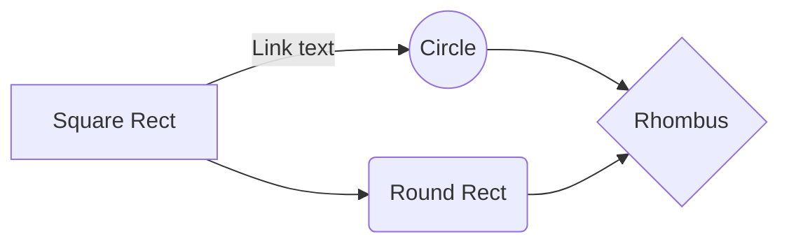
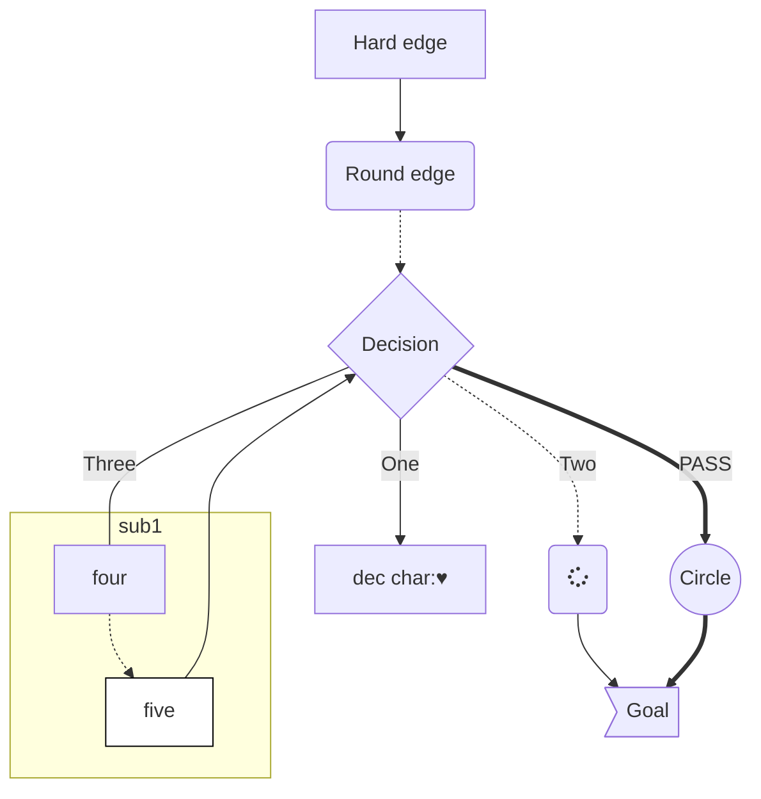
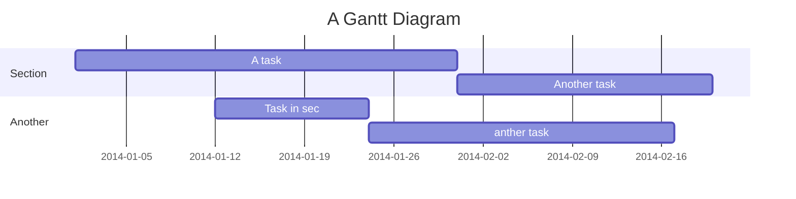
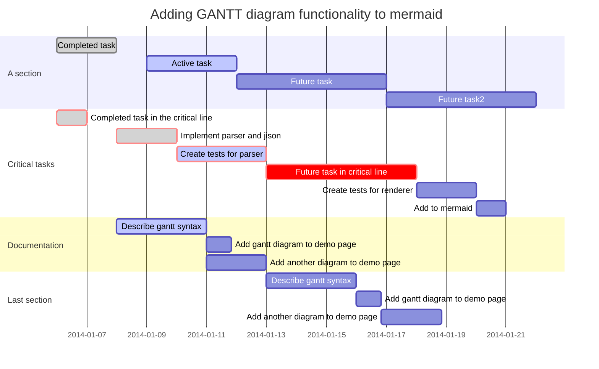
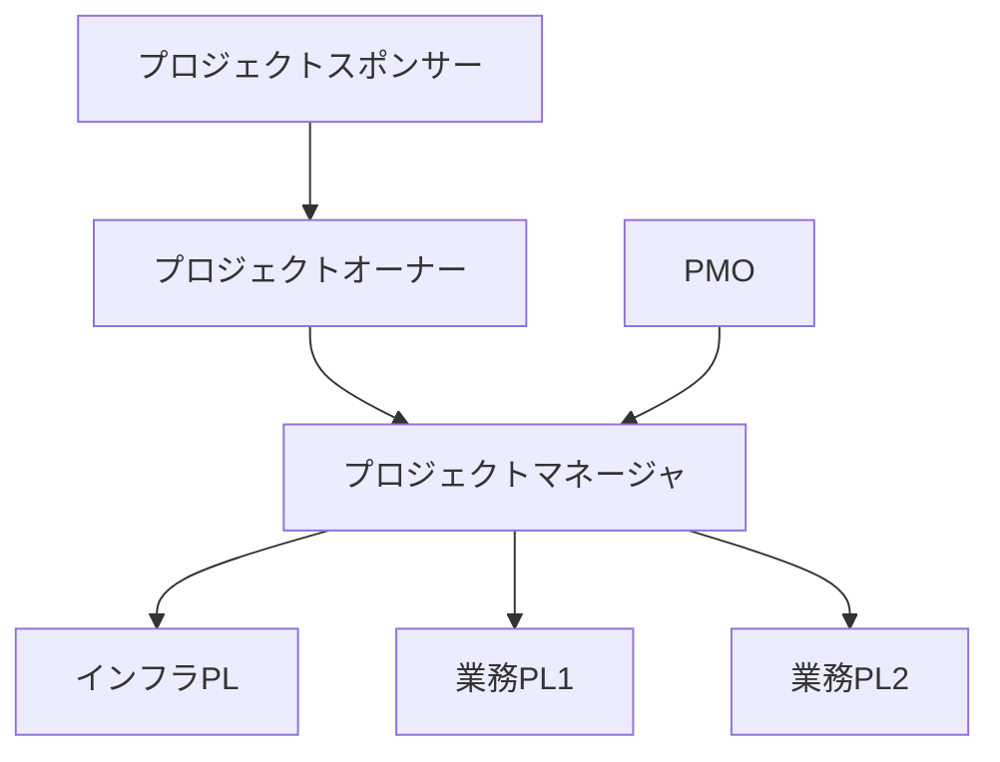
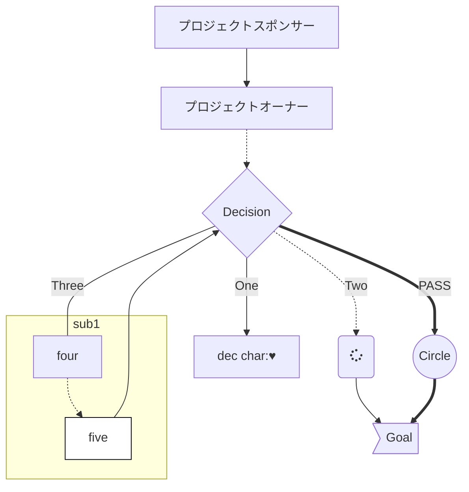

### シーケンス図

```sequence
Title: Here is a title
A->B: Normal line
B-->C: Dashed line
C->>D: Open arrow
D-->>A: Dashed open arrow

Note left of A: Note to the\n left of A
Note over A: Note over A
Note over A,B: Note over both A and B

participant E
```

### フローチャート

```flow
st=>start: Start :>http://www.google.com[blank]
op1=>operation: My Operation
io=>inputoutput: catch something...
sub1=>subroutine: My Subroutine
cond=>condition: Yes or No?
e=>end

st(right)->op1(right)->io(right)->sub1(right)->cond
cond(yes)->e
cond(no)->op1
```




ガントチャート





?										/	/






